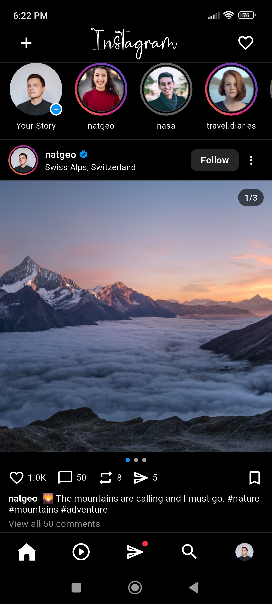
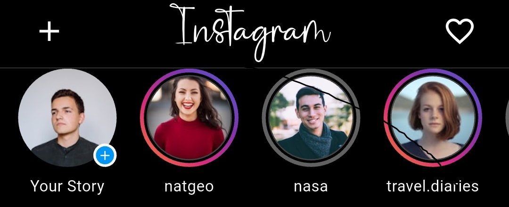
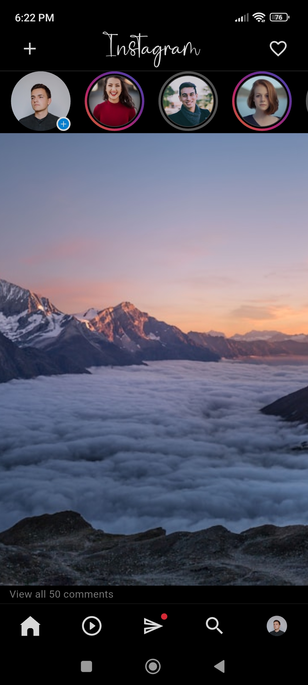
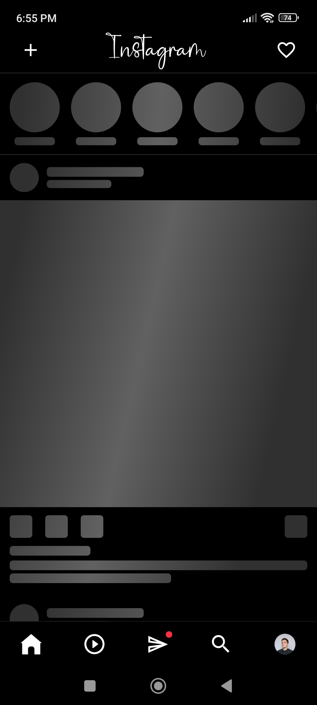
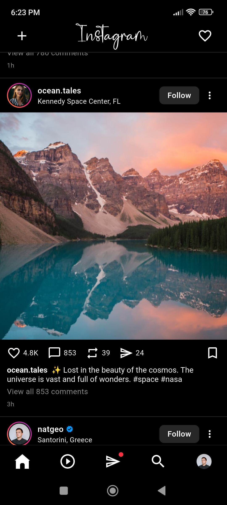
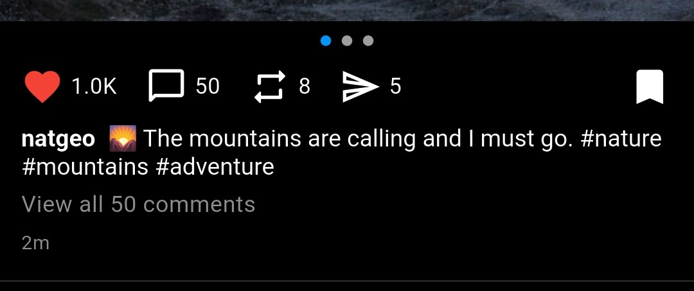

# 📱 Instagram Flutter Clone

A **pixel-perfect** Instagram Home Feed clone built with Flutter — replicating the look, feel, and interactions of the real Instagram app.


---

## ✨ Features

- 📖 **Stories Tray** — Horizontally scrollable stories with gradient rings and "Your Story" badge
- 🖼️ **Feed Posts** — Full-width posts with captions, likes, comments, and timestamps
- 🔍 **Pinch-to-Zoom** — Smooth overlay zoom using `InteractiveViewer` with spring-back animation
- ♾️ **Infinite Scrolling** — Auto-fetches next page when approaching the end of the feed
- ❤️ **Like & Save** — Stateful toggle buttons with animated transitions and double-tap to like
- ✨ **Shimmer Loading** — Skeleton loaders on initial load and pagination (no plain spinners)
- 🗂️ **Carousel Posts** — Multi-image posts with dot indicator and page counter badge
- 🌐 **Cached Network Images** — Memory and disk caching via `cached_network_image`
- 📐 **Responsive UI** — Uses `MediaQuery` for pixel-perfect sizing across all screen sizes

---

## 🛠️ Tech Stack

| Layer | Technology |
|---|---|
| Framework | Flutter 3.x |
| Language | Dart 3.x |
| State Management | Provider 6.x |
| Image Caching | cached_network_image |
| Loading Skeleton | shimmer |
| Fonts | google_fonts (Grand Hotel) |

---

## 🎥 Demo

<p align="center">
  
</p>

---

## 📸 Screenshots

| Home Feed | Stories | Pinch-to-Zoom |
|---|---|---|
|  |  |  |

| Shimmer Loading | Carousel Post | Like Toggle |
|---|---|---|
|  |  |  |

---

## 🚀 How to Run

### Prerequisites
- Flutter SDK `>=3.0.0`
- Dart SDK `>=3.0.0`
- Android Studio / VS Code with Flutter plugin

### Steps

```bash
# 1. Clone the repository
git clone https://github.com/pawanshersiya/instagram_clone.git
cd instagram_clone

# 2. Install dependencies
flutter pub get

# 3. Run the app
flutter run

# 4. Build release APK (optional)
flutter build apk --release
```

---

## 📁 Project Structure

```
lib/
├── main.dart                    # App entry point & MultiProvider root
│
├── models/
│   ├── post_model.dart          # PostModel, UserModel data classes
│   └── story_model.dart         # StoryModel data class
│
├── services/
│   └── post_repository.dart     # Mock data layer with 1.5s simulated delay
│
├── providers/
│   └── feed_provider.dart       # ChangeNotifier providers (feed, like, save, carousel)
│
├── screens/
│   └── home_screen.dart         # Main screen with top bar & bottom nav
│
└── widgets/
    ├── post_card.dart           # Full post UI component
    ├── stories_tray.dart        # Horizontal stories strip
    ├── pinch_to_zoom.dart       # InteractiveViewer-based zoom gesture
    ├── cached_avatar.dart       # Reusable cached circular avatar
    └── shimmer_post.dart        # Skeleton loaders for posts & stories
```

---

## 🔮 Future Improvements

- [ ] Add Instagram Reels screen with video playback
- [ ] Implement Comments bottom sheet
- [ ] Add real authentication (Firebase Auth)
- [ ] Connect to a live API or Firebase Firestore
- [ ] Add Story viewing screen with progress bar
- [ ] Dark / Light mode toggle
- [ ] Explore / Search screen
- [ ] Push notifications support

---

## 👨‍💻 Author

**Pawan Shersiya**

[](https://github.com/pawanshersiya)

---
   